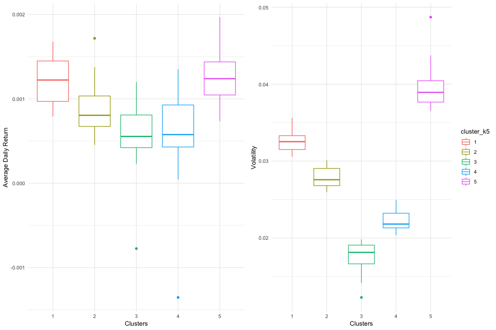

Nasdaq Stock Market
================
Ashley O’Mahony | [ashleyomahony.com](http://ashleyomahony.com) |
December 2018

<br><br>

-----

##### ***Notes***

*This report can be generated using the theme `cayman` from the package
`prettydoc`. If the package is not installed on your machine, it is
recommended to use the default RMarkdown `html_document` theme `yeti`.*

*The report also requires 9 packages which will be installed
automatically if not already present on your machine: `readxl, tidyr,
BatchGetSymbols, data.table, ggplot2, gridExtra, factoextra, ggrepel,
knitr`.*

<br><br>

-----

## Objective

This analysis aims to understand the relationship between 103 Nasdaq
stocks, considering their average daily return and volatility.

The data is downloaded from [Yahoo\!
Finance](https://finance.yahoo.com), for the past 20 years starting from
14 August 1999.

<br><br>

-----

## Data Download

The data is downloaded using the method `BatchGetSymbols` from the
package `BatchGetSymbols`. The resulting dataframe contains stock market
figures per day for each of the 103 stocks.

``` r
dl_stock_data <- BatchGetSymbols(tickers = nasdaq_stock_list$Symbol,
                                 first.date = first_date,
                                 last.date = last_date,
                                 freq.data = freq_data,
                                 thresh.bad.data = thresh.bad.data)
```

    ##   price.open price.high price.low price.close  volume price.adjusted
    ## 1      21.05      21.40     19.10       19.30  961200       18.48912
    ## 2      19.30      20.53     19.20       20.50 5747900       19.63870
    ## 3      20.40      20.58     20.10       20.21 1078200       19.36088
    ## 4      20.26      21.05     20.18       21.01 3123300       20.12728
    ## 5      20.90      21.75     20.90       21.50 1057900       20.59668
    ## 6      21.44      22.50     21.44       22.16 1768800       21.22896
    ##     ref.date ticker ret.adjusted.prices ret.closing.prices
    ## 1 2005-09-27    AAL                  NA                 NA
    ## 2 2005-09-28    AAL          0.06217602         0.06217622
    ## 3 2005-09-29    AAL         -0.01414645        -0.01414639
    ## 4 2005-09-30    AAL          0.03958461         0.03958442
    ## 5 2005-10-03    AAL          0.02332193         0.02332223
    ## 6 2005-10-04    AAL          0.03069805         0.03069767

<br><br> Note that among the 103 Nasdaq stocks, 33.01 % didn’t have
complete information on the selected period. The table below lists the
concerned stocks and the percentage of available data. However, the
missing data shouldn’t be impacting our analysis, as we will consider
the average values on the period.

    ##    Stock Code                   Stock Name Data %
    ## 1         AAL  American Airlines Group Inc   69 %
    ## 2        ALGN         Align Technology Inc   92 %
    ## 3        AVGO                 Broadcom Inc   50 %
    ## 4        BIDU                    Baidu Inc   70 %
    ## 5        CHTR   Charter Communications Inc   48 %
    ## 6        CTRP  Ctrip.Com International Ltd   78 %
    ## 7        ESRX   Express Scripts Holding Co   96 %
    ## 8        EXPE            Expedia Group Inc   70 %
    ## 9          FB                     Facebook   36 %
    ## 10        FOX Twenty-First Century Fox Inc   99 %
    ## 11       FOXA Twenty-First Century Fox Inc   99 %
    ## 12       GOOG             Alphabet Class C   74 %
    ## 13      GOOGL             Alphabet Class A   74 %
    ## 14       ILMN                 Illumina Inc   95 %
    ## 15       ISRG       Intuitive Surgical Inc   95 %
    ## 16         JD                   JD.com Inc   26 %
    ## 17        KHC               Kraft Heinz Co   20 %
    ## 18      LBTYA           Liberty Global PLC   76 %
    ## 19      LBTYK           Liberty Global PLC   69 %
    ## 20       MDLZ   Mondelez International Inc   90 %
    ## 21       MELI             MercadoLibre Inc   60 %
    ## 22       NFLX                  Netflix Inc   86 %
    ## 23       NTES                  NetEase Inc   95 %
    ## 24       NXPI        NXP Semiconductors NV   45 %
    ## 25       PYPL          PayPal Holdings Inc   20 %
    ## 26      QRTEA            Qurate Retail Inc    7 %
    ## 27       SHPG                    Shire PLC   97 %
    ## 28        STX       Seagate Technology PLC   83 %
    ## 29       TMUS              T-Mobile US Inc   61 %
    ## 30       TSLA                    Tesla Inc   45 %
    ## 31       ULTA              Ulta Beauty Inc   59 %
    ## 32       VRSK         Verisk Analytics Inc   49 %
    ## 33       WDAY                  Workday Inc   34 %
    ## 34       WYNN             Wynn Resorts Ltd   84 %

<br><br>

-----

## Data Preparation

For this analysis, we use the *Closing Price* (`price.close`) which is
the last price of the stock at the market closure. We calculate the
difference compared to the *Closing Price* of the previous day, and
compute it to a change ratio:

\[\frac{ClosingPriceD1-ClosingPriceD0}{ClosingPriceD0}\]

<br><br> The resulting dataframe looks like this:

    ##         stock_code   ref.date price.close daily_diff daily_return
    ##      1:        AAL 2005-09-27       19.30         NA           NA
    ##      2:        AAL 2005-09-28       20.50   1.200001  0.062176221
    ##      3:        AAL 2005-09-29       20.21  -0.290001 -0.014146390
    ##      4:        AAL 2005-09-30       21.01   0.800001  0.039584416
    ##      5:        AAL 2005-10-03       21.50   0.490000  0.023322228
    ##     ---                                                          
    ## 460773:       XLNX 2019-08-02      110.18  -3.279999 -0.028908858
    ## 460774:       XLNX 2019-08-05      107.01  -3.169998 -0.028771084
    ## 460775:       XLNX 2019-08-06      105.66  -1.349998 -0.012615624
    ## 460776:       XLNX 2019-08-07      104.92  -0.740006 -0.007003653
    ## 460777:       XLNX 2019-08-08      109.84   4.919998  0.046892853

<br><br>

We then aggregate the values to calculate the *Average Daily Return* and
the *Volatility* (i.e. standard deviation) for each stock:

    ##      stock_code                    stock_name daily_return_mean
    ##   1:        AAL   American Airlines Group Inc      0.0009913384
    ##   2:       AAPL                     Apple Inc      0.0012567556
    ##   3:       ADBE                    Adobe Inc.      0.0010287211
    ##   4:        ADI            Analog Devices Inc      0.0006692107
    ##   5:        ADP Automatic Data Processing Inc      0.0004503575
    ##  ---                                                           
    ##  99:       WDAY                   Workday Inc      0.0010753307
    ## 100:        WDC          Western Digital Corp      0.0012089694
    ## 101:       WYNN              Wynn Resorts Ltd      0.0009700915
    ## 102:        XEL               Xcel Energy Inc      0.0003490931
    ## 103:       XLNX                    Xilinx Inc      0.0006268699
    ##      daily_return_sd Data %
    ##   1:      0.04216769   69 %
    ##   2:      0.02595867  100 %
    ##   3:      0.02757136  100 %
    ##   4:      0.02688987  100 %
    ##   5:      0.01533434  100 %
    ##  ---                       
    ##  99:      0.02333052   34 %
    ## 100:      0.03788840  100 %
    ## 101:      0.03055400   84 %
    ## 102:      0.01663284  100 %
    ## 103:      0.02838089  100 %

<br><br>

This last table will be the basis for our cluster analysis. We can
visualize the information as
below:


<br><br>

-----

## Cluster Analysis: K-Means

The selected algotrithm for this analysis is the *K-Means*, which is a
fast method to group similar cases. We will perform several analysis,
with different *k* values to identify a good solution.

``` r
# Run K-means algorithms with different k values
set.seed(1410)
k2 <- kmeans(stock_return_stats[,c('daily_return_mean','daily_return_sd')],centers = 2, nstart = 25)
k3 <- kmeans(stock_return_stats[,c('daily_return_mean','daily_return_sd')], centers = 3, nstart = 25)
k4 <- kmeans(stock_return_stats[,c('daily_return_mean','daily_return_sd')], centers = 4, nstart = 25)
k5 <- kmeans(stock_return_stats[,c('daily_return_mean','daily_return_sd')], centers = 5, nstart = 25)
k6 <- kmeans(stock_return_stats[,c('daily_return_mean','daily_return_sd')], centers = 6, nstart = 25)
k7 <- kmeans(stock_return_stats[,c('daily_return_mean','daily_return_sd')], centers = 7, nstart = 25)

# Add cluster values in dataset
stock_return_stats$cluster_k2 <- as.factor(k2$cluster)
stock_return_stats$cluster_k3 <- as.factor(k3$cluster)
stock_return_stats$cluster_k4 <- as.factor(k4$cluster)
stock_return_stats$cluster_k5 <- as.factor(k5$cluster)
stock_return_stats$cluster_k6 <- as.factor(k6$cluster)
stock_return_stats$cluster_k7 <- as.factor(k7$cluster)
```


<br><br>

-----

## Analysis

From these charts and the number of cases per cluster shown in the table
below, we can already eliminate k=2, k=6 and k=7: \* k=2 generates
clusters which seem too large, \* k=6 and k=7 generates clusters with
only a few
cases.

| k = 2  |   k = 3    |     k = 4      |       k = 5        |         k = 6         |          k = 7           |
| :----: | :--------: | :------------: | :----------------: | :-------------------: | :----------------------: |
| 40, 63 | 16, 42, 45 | 16, 28, 42, 17 | 13, 31, 17, 28, 14 | 14, 13, 3, 27, 22, 24 | 13, 14, 9, 28, 3, 14, 22 |

<br><br>

The choice between k=3, k=4 and k=5 is a bit harder, but we would select
k=5 as it shows clusters with more balanced numbers of cases. The
detailled results of the K-Mean algorithm with k=5 are:

    ## K-means clustering with 5 clusters of sizes 13, 31, 17, 28, 14
    ## 
    ## Cluster means:
    ##   daily_return_mean daily_return_sd
    ## 1      0.0012164960      0.03265923
    ## 2      0.0008815449      0.02783510
    ## 3      0.0005778579      0.01763856
    ## 4      0.0005952686      0.02225341
    ## 5      0.0012637262      0.03978417
    ## 
    ## Clustering vector:
    ##   [1] 5 2 2 2 3 2 5 1 2 4 1 2 2 4 1 2 5 1 2 1 2 2 3 4 3 4 4 3 1 2 1 2 4 2 2
    ##  [36] 4 2 4 4 3 4 4 2 3 3 3 2 3 4 5 5 4 2 1 4 2 3 2 4 4 1 4 2 3 1 2 3 5 2 4
    ##  [71] 5 5 5 2 4 3 4 3 2 4 5 4 4 4 5 4 2 5 2 2 1 1 4 2 4 3 5 3 4 5 1 3 2
    ## 
    ## Within cluster sum of squares by cluster:
    ## [1] 3.060778e-05 5.399926e-05 7.459454e-05 5.610184e-05 1.432141e-04
    ##  (between_SS / total_SS =  93.1 %)
    ## 
    ## Available components:
    ## 
    ## [1] "cluster"      "centers"      "totss"        "withinss"    
    ## [5] "tot.withinss" "betweenss"    "size"         "iter"        
    ## [9] "ifault"


<br><br>

Looking at the clusters in more details, we can see which companies are
grouped together by the
algorithm:

|             Cluster 1             |               Cluster 2               |           Cluster 3           |            Cluster 4             |           Cluster 5           |
| :-------------------------------: | :-----------------------------------: | :---------------------------: | :------------------------------: | :---------------------------: |
|    Alexion Pharmaceuticals Inc    |               Apple Inc               | Automatic Data Processing Inc |            Amgen Inc             |  American Airlines Group Inc  |
|          Amazon.com Inc           |              Adobe Inc.               |  Charter Communications Inc   |           Broadcom Inc           |     Align Technology Inc      |
|             Baidu Inc             |          Analog Devices Inc           |     Costco Wholesale Corp     |           Comcast Corp           |     Booking Holdings Inc      |
|    Biomarin Pharmaceutical Inc    |             Autodesk Inc              |          Cintas Corp          |        Cisco Systems Inc         |         Illumina Inc          |
|           Celgene Corp            |         Applied Materials Inc         |          Fiserv Inc           |             CSX Corp             |          Incyte Corp          |
|    Ctrip.Com International Ltd    |            ASML Holding NV            |       Alphabet Class C        |         Dollar Tree Inc          |     Micron Technology Inc     |
|        Citrix Systems Inc         |        Activision Blizzard Inc        |       Alphabet Class A        |    Express Scripts Holding Co    |          Netflix Inc          |
|      Intuitive Surgical Inc       |              Biogen Inc               |          Hasbro Inc           |           Fastenal Co            |          NetEase Inc          |
|         Lam Research Corp         |      Cadence Design Systems Inc       |       Henry Schein Inc        |             Facebook             |          NVIDIA Corp          |
|         MercadoLibre Inc          |              Cerner Corp              |        Kraft Heinz Co         |   Twenty-First Century Fox Inc   | Regeneron Pharmaceuticals Inc |
|             Tesla Inc             | Check Point Software Technologies Ltd |  Mondelez International Inc   |   Twenty-First Century Fox Inc   |    Sirius XM Holdings Inc     |
| Take-Two Interactive Software Inc |  Cognizant Technology Solutions Corp  |        Microsoft Corp         |      IDEXX Laboratories Inc      |    Skyworks Solutions Inc     |
|         Wynn Resorts Ltd          |           DISH Network Corp           |          Paychex Inc          |            Intel Corp            |  Vertex Pharmaceuticals Inc   |
|                                   |            Electronic Arts            |      PayPal Holdings Inc      | J.B. Hunt Transport Services Inc |     Western Digital Corp      |
|                                   |               eBay Inc                |     Verisk Analytics Inc      |        Liberty Global PLC        |                               |
|                                   |           Expedia Group Inc           | Walgreens Boots Alliance Inc  |        Liberty Global PLC        |                               |
|                                   |          Gilead Sciences Inc          |        Xcel Energy Inc        |    Marriott International Inc    |                               |
|                                   |              Hologic Inc              |                               |             Mylan NV             |                               |
|                                   |              Intuit Inc               |                               |     O’Reilly Automotive Inc      |                               |
|                                   |              JD.com Inc               |                               |            PACCAR Inc            |                               |
|                                   |            KLA-Tencor Corp            |                               |        Qurate Retail Inc         |                               |
|                                   |       Microchip Technology Inc        |                               |         Ross Stores Inc          |                               |
|                                   |         Monster Beverage Corp         |                               |          Starbucks Corp          |                               |
|                                   |     Maxim Integrated Products Inc     |                               |            Shire PLC             |                               |
|                                   |         NXP Semiconductors NV         |                               |           Synopsys Inc           |                               |
|                                   |             Qualcomm Inc              |                               |      Texas Instruments Inc       |                               |
|                                   |        Seagate Technology PLC         |                               |        Vodafone Group PLC        |                               |
|                                   |             Symantec Corp             |                               |           Workday Inc            |                               |
|                                   |            T-Mobile US Inc            |                               |                                  |                               |
|                                   |            Ulta Beauty Inc            |                               |                                  |                               |
|                                   |              Xilinx Inc               |                               |                                  |                               |

<br><br>

The boxplot below shows how the clusters have been designed considering
the *Average Daily Return* and *Volatility* values of each
case:



<br><br>

The *Volatily* seems to hav been the clear differentiator of the groups,
while the *Average Daily Return* can be overlapping for several groups.
However, it is possible to describe each cluster based on these
parameters:

|    Parameter     | Cluster 1 | Cluster 2 |  Cluster 3   | Cluster 4 | Cluster 5 |
| :--------------: | :-------: | :-------: | :----------: | :-------: | :-------: |
| Av. Daily Return |   High    |   High    | Low/Negative |    Low    |    Low    |
|    Volatility    |   High    | Very High |     Low      |  Medium   |  Medium   |

<br><br>

## Conclusions

This cluster analysis can help investors to identify in which companies
they should invest for their long-term investments, based on their
profile and risk aversion.

The **clusters `1` and `2`** have **high *Average Daily Returns*** but
also **high *Volatilities***. Individuals willing to invest in these
companies should be will to take higher risk and accept to see their
capital decrease and increase quickly. It is particularly true for the
companies in Cluster `2`, like *Western Digital*, as they have a higher
*Volatility* but don’t seem to provide the corresponding effect in
returns.

The **clusters `4` and `5`**, in comparison, have **low *Average Daily
Returns*** but **medium *Volatilities***. These companies would be
perfect fits for wiser profiles. People liking risk slightly more could
invest in companies of cluster `4`, like *Apple*, in order to get
**higher returns**.

The **cluster `3`** seems to list the companies to avoid. These are very
stable with **very low *Volatilities***, but their ***Average Daily
Return* is also very low**, and even sometimes **negative**, like
***Verisk Analytics*\!**

Overall, **the clusters `2` and `4` seem to be the most attractive**, as
they offer a fairly good balance between risk and return.

<br><br>
